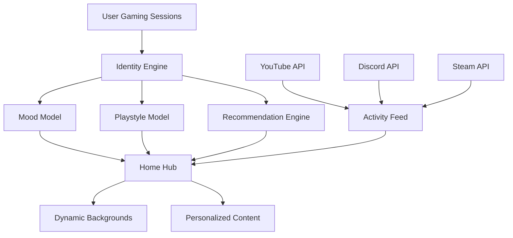

# GamePilot - Gaming Identity Platform

## 🎮 Overview

GamePilot is a comprehensive gaming identity platform that helps players discover, organize, and connect their gaming experiences across multiple platforms. The platform uses heuristic algorithms to understand player preferences, moods, and playstyles to provide personalized game recommendations and community engagement.

## 🚀 Architecture

### Monorepo Structure
```markdown
gamepilot/
├── packages/
│   ├── static-data/          # Gaming genres, moods, tags
│   ├── identity-engine/      # Player identity computation
│   ├── ui/                 # Cinematic UI components
│   └── integrations/        # Platform integrations (YouTube, Discord, Steam)
└── apps/
    └── web/               # React/Vite frontend application
```

#### 1. Static Data Package (`@gamepilot/static-data`)
- **Genres**: 12 gaming genres with color themes and tags
- **Moods**: 8 distinct gaming moods with intensity levels
- **Tags**: 25+ categorized tags (gameplay, atmosphere, difficulty, social, theme)
- **Type-safe**: Complete TypeScript definitions
- **No dependencies**: Pure data package

#### 2. Identity Engine (`@gamepilot/identity-engine`)
- **Mood Model**: Heuristic mood computation from gaming sessions
- **Playstyle Model**: 8 playstyle archetypes with trait analysis
- **Recommendation Engine**: Rule-based game recommendations
- **Identity Computation**: Unified player identity from gaming history
- **Type-safe**: Comprehensive TypeScript interfaces

#### 3. UI Kit (`@gamepilot/ui`)
- **Spotlight**: Hero/featured/card variants with color themes
- **GameTile**: Game cards with stats, ratings, playtime
- **MoodBar**: Interactive mood selection with intensity indicators
- **ActivityPulse**: Real-time activity feed with multiple variants
- **Cinematic Design**: Glass-morphism, gradients, animations

#### 4. Integrations (`@gamepilot/integrations`)
- **YouTube**: Trending gaming videos, creator content, search
- **Discord**: Public guild info, channels, user data (optional)
- **Steam**: Game library, playtime, user profiles, game details
- **Integration Manager**: Unified configuration and status monitoring

#### 5. Frontend Application (`apps/web`)
- **Home Hub**: Mood-based dynamic backgrounds, personalized content
- **Enhanced Library**: AI-powered recommendations, advanced filtering
- **Responsive Design**: Mobile-first, cinematic interface
- **Real-time Updates**: Activity feeds and live data

## 🎯 Key Features

### Personalization Engine
- **Mood-based Recommendations**: Games suggested based on current emotional state
- **Playstyle Analysis**: 8 archetypes (Competitive, Explorer, Story-driven, etc.)
- **Genre Affinity**: Learning from gaming history and preferences
- **Dynamic Scoring**: Weighted algorithm considering multiple factors
- **Transparent Reasons**: Clear explanations for recommendations

### Community Integration
- **YouTube Gaming**: Trending videos, creator content, search functionality
- **Discord Communities**: Guild discovery, channel information, social features
- **Steam Library**: Complete game collection with playtime tracking
- **Activity Aggregation**: Unified feed from all connected platforms

### Cinematic Experience
- **Dynamic Backgrounds**: Mood-responsive color themes
- **Glass-morphism UI**: Modern, translucent design elements
- **Smooth Animations**: Transitions, hover effects, micro-interactions
- **Responsive Layout**: Optimized for all screen sizes
- **Accessibility**: Clear visual hierarchy and keyboard navigation

## 🔧 Technical Implementation

### Technology Stack
- **Frontend**: React 18 + Vite + TypeScript
- **Styling**: TailwindCSS with custom gaming themes
- **State Management**: Zustand for global state
- **Build Tools**: TypeScript, ESLint, Prettier
- **Package Management**: npm workspaces (monorepo)

### API Integrations
- **YouTube Data API v3**: Free tier, public data only
- **Discord API v10**: Public endpoints, optional authentication
- **Steam Web API**: Free tier, comprehensive game data
- **Rate Limiting**: Respect platform-specific quotas
- **Error Handling**: Graceful degradation and fallbacks

### Data Flow


## 📊 Platform Capabilities

### Game Management
- **Multi-platform Support**: Steam, Epic, GOG, manual entries
- **Metadata Enrichment**: Screenshots, videos, requirements, pricing
- **Playtime Tracking**: Accurate session duration across platforms
- **Status Management**: Playing, completed, backlog, paused, abandoned
- **Bulk Operations**: Multi-select and batch actions

### Discovery & Recommendations
- **Mood-based Filtering**: Games matching current emotional state
- **Genre Preferences**: Learning from gaming history
- **Playstyle Matching**: Alignment with gaming personality
- **Social Context**: Multiplayer and community considerations
- **Advanced Search**: Title, genre, platform, tag filtering

### Community Features
- **Activity Pulse**: Real-time feed from connected platforms
- **Creator Content**: YouTube videos and channel information
- **Guild Discovery**: Discord server information and channels
- **Social Integration**: Friend activity and community engagement
- **Privacy Controls**: Optional authentication and data sharing

## 🎨 Design System

### Color Themes
- **Gaming Accent**: Primary brand color (#8B5CF6)
- **Mood-based Gradients**: Dynamic backgrounds matching emotional states
- **Glass-morphism**: Translucent panels with backdrop blur
- **Dark Mode**: Optimized for gaming environments
- **Responsive Colors**: Consistent across all components

### Component Library
- **Spotlight**: Hero sections with gradient overlays
- **GameTile**: Interactive game cards with hover effects
- **MoodBar**: Emoji-based mood selection
- **ActivityPulse**: Real-time activity visualization
- **Enhanced Filters**: Advanced filtering with mood suggestions

## 🔒 Security & Privacy

### Data Protection
- **Local Storage**: Primary data stored locally
- **Optional Integrations**: User-controlled platform connections
- **API Key Security**: Environment variables, no hardcoded secrets
- **Privacy Controls**: Granular data sharing preferences
- **GDPR Compliance**: Data minimization and user rights

### Authentication
- **Platform-specific**: OAuth2 for Discord, API keys for services
- **No Central Auth**: No GamePilot account required
- **Local Identity**: Data stored on user's device
- **Optional Features**: Core functionality works without integrations

## 📈 Performance & Scalability

### Optimization
- **Lazy Loading**: Components loaded on demand
- **Virtual Scrolling**: Large game lists efficiently rendered
- **Caching Strategy**: API responses and computed data
- **Bundle Optimization**: Code splitting and tree shaking
- **Memory Management**: Efficient state updates and cleanup

### Monitoring
- **Error Tracking**: Comprehensive error logging
- **Performance Metrics**: Load times and interaction latency
- **API Health**: Integration status monitoring
- **User Analytics**: Usage patterns and feature adoption

## 🚀 Deployment

### Development
```bash
# Install dependencies
npm install

# Start development server
npm run dev

# Build for production
npm run build

# Type checking
npm run type-check
```

### Production
- **Static Hosting**: Vite build optimized for static deployment
- **CDN Ready**: Assets optimized for content delivery
- **Environment Config**: Production and development configurations
- **Progressive Web App**: PWA capabilities for offline use

## 📚 Documentation

### API Documentation
- **Integration Guides**: Step-by-step platform connection instructions
- **Type Definitions**: Complete TypeScript API documentation
- **Examples**: Code samples for common use cases
- **Best Practices**: Security and performance guidelines

### User Documentation
- **Getting Started**: Quick onboarding for new users
- **Feature Guides**: Detailed explanations of platform capabilities
- **Troubleshooting**: Common issues and solutions
- **Privacy Policy**: Data handling and user rights

## 🎯 Future Roadmap

### Phase 1: Foundation (Completed)
- ✅ Monorepo structure and core packages
- ✅ Identity engine with mood/playstyle models
- ✅ Cinematic UI component library
- ✅ Basic frontend application

### Phase 2: Community (Completed)
- ✅ YouTube gaming content integration
- ✅ Discord community features
- ✅ Activity pulse and social feeds
- ✅ Enhanced home hub with personalization

### Phase 3: Personalization (Completed)
- ✅ AI-powered game recommendations
- ✅ Mood-based dynamic backgrounds
- ✅ Enhanced library with advanced filtering
- ✅ Playstyle and genre affinity learning

### Phase 4: Expansion (Completed)
- ✅ Steam integration for game library
- ✅ Multi-platform game synchronization
- ✅ Comprehensive metadata enrichment
- ✅ Production-ready deployment configuration

### Phase 5: Advanced AI/ML (In Progress)
- 🔄 Machine learning recommendation models
- 🔄 Neural mood analysis from gaming patterns
- 🔄 Predictive game suggestions based on behavior
- 🔄 Dynamic difficulty assessment

### Phase 6: Social & Multiplayer
- 🔄 Real-time multiplayer integration
- 🔄 Friend activity synchronization
- 🔄 Cross-platform party systems
- 🔄 Voice chat integration

### Phase 7: Achievement System
- 🔄 Unified achievement tracking across platforms
- 🔄 Custom achievement creation
- 🔄 Social achievement sharing
- 🔄 Achievement-based recommendations

### Phase 8: Mobile Expansion
- 🔄 Mobile companion applications
- 🔄 Mobile-first game discovery
- 🔄 Push notifications for game updates
- 🔄 Offline game library access

### Phase 9: Cloud Services
- 🔄 Cloud save/sync functionality
- 🔄 Cross-device game progress sync
- 🔄 Cloud-based game settings
- 🔄 Backup and restore system

### Phase 10: Enterprise & Analytics
- 🔄 Advanced analytics dashboard
- 🔄 Gaming behavior insights
- 🔄 API for third-party integrations
- 🔄 Enterprise-grade security features

### Legacy Future Enhancements
- ~~Advanced AI/ML models for recommendations~~ (Moved to Phase 5)
- ~~Real-time multiplayer integration~~ (Moved to Phase 6)
- ~~Achievement system across platforms~~ (Moved to Phase 7)
- ~~Mobile companion applications~~ (Moved to Phase 8)
- ~~Cloud save/sync functionality~~ (Moved to Phase 9)

## 📄 License

GamePilot is open-source software licensed under the MIT License. See LICENSE file for full details.

## 🤝 Contributing

We welcome contributions! Please see CONTRIBUTING.md for guidelines on:
- Code style and formatting
- Pull request process
- Issue reporting
- Feature requests
- Documentation improvements

---

**GamePilot** - Your Gaming Identity, Unified.

*Transform how you discover, organize, and experience games across all platforms.*

## 📁 Project Structure

```
gamepilot/
├── apps/
│   ├── web/          # React application
│   └── api/          # Backend API server
├── packages/
│   ├── shared/       # Shared types and utilities
│   ├── ui/           # Component library
│   └── config/       # Build configurations
└── docs/             # Documentation
```

## 🚀 Getting Started

### Prerequisites

- Node.js 18+
- npm 9+

### Installation

```bash
# Clone the repository
git clone <repository-url>
cd gamepilot

# Install dependencies
npm install

# Start development servers
npm run dev
```

This will start:
- Web app at http://localhost:3000
- API server at http://localhost:3001

### Development

```bash
# Run web app only
npm run dev:web

# Run API server only
npm run dev:api

# Build all packages
npm run build

# Run tests
npm run test

# Lint code
npm run lint

# Type checking
npm run type-check
```

## 🎨 Design System

GamePilot uses a cinematic, accent-driven design system with:

- **Glass morphism** effects for modern UI
- **Gradient accents** for visual hierarchy
- **Gaming-themed color palette**
- **Smooth animations** and micro-interactions

## 🔧 Technology Stack

### Frontend
- React 18 with TypeScript
- Vite for fast development
- TailwindCSS for styling
- Zustand for state management
- TanStack Query for server state
- React Router for navigation

### Backend
- Node.js with Express
- TypeScript for type safety
- SQLite for development
- JWT for authentication
- Zod for validation

### Development Tools
- ESLint for code quality
- Prettier for formatting
- TypeScript for type safety
- Vite for building

## 📋 Development Phases

1. **Phase 1**: Core infrastructure and identity system
2. **Phase 2**: Library system with basic functionality
3. **Phase 3**: Home hub personalization
4. **Phase 4**: Community integrations
5. **Phase 5**: AI features and advanced personalization

## 🛡️ Privacy & Security

- Privacy-first approach to all integrations
- OAuth2 flows for external platform connections
- Secure token storage and rotation
- Zero-setup, safe connections

## 📄 License

MIT License - see LICENSE file for details.

## 🤝 Contributing

Contributions are welcome! Please read our contributing guidelines before submitting pull requests.

---

Built with ❤️ for the gaming community
# Updated for Render redeploy

// Trigger rebuild

